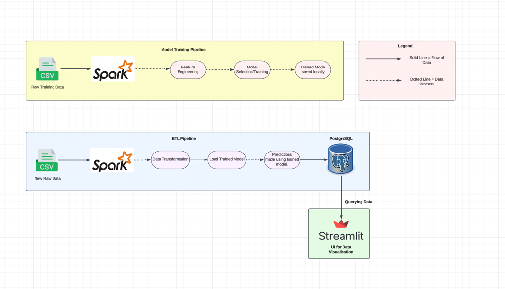

## **Machine Learning ETL and Model Training Pipeline**

This project implements a **machine learning pipeline** that includes **model training, ETL (Extract, Transform, Load) processes, and data visualization** using **Apache Spark, PostgreSQL, and Streamlit**. The pipeline is divided into two main components:  

1. **Model Training Pipeline** – Trains a machine learning model on raw data.  
2. **ETL Pipeline** – Processes new data, makes predictions using the trained model, and stores results in a PostgreSQL database for visualization.  

---

## **Architecture Overview**





The system consists of the following components:  

### **1. Model Training Pipeline**
This pipeline is responsible for training the machine learning model.  

- **Input**: Raw training data (CSV format)  
- **Processing**:
  - **Feature Engineering**: Data cleaning and transformation  
  - **Model Selection/Training**: Training a machine learning model  
  - **Model Storage**: The trained model is saved locally  
- **Technology**: Apache Spark  

### **2. ETL Pipeline**
This pipeline processes new incoming data and applies the trained model to generate predictions.  

- **Input**: New raw data (CSV format)  
- **Processing**:
  - **Data Transformation**: Cleans and preprocesses the data  
  - **Load Trained Model**: Loads the previously trained model  
  - **Generate Predictions**: Uses the trained model to predict outcomes  
- **Output**: Predictions are stored in a **PostgreSQL database**  

### **3. Data Visualization**
- The stored predictions in **PostgreSQL** can be **queried and visualized** using **Streamlit**.  

---

## **Technology Stack**
- **Apache Spark** – Handles large-scale data processing.  
- **PostgreSQL** – Stores prediction results.  
- **Streamlit** – Provides a UI for visualizing predictions.  
- **Python** – Main programming language for the pipeline.  

---

## **Installation & Setup**
 

### **1. Clone the Repository**
```bash
git clone https://github.com/Zacplischka/FraudDetection.git
cd FraudDetection
```

### **2. Install Dependencies**
```bash
pip install -r requirements.txt
```

### **3. Run docker-compose**
```bash
docker-compose up
```

### **4. Execute the ETL and Model-Training Pipelines**
Open a terminal in the project root directory and run the following command:
```bash
python main.py
```

### **5. View streamlit dashboard**
Check docker-compose logs for the port number
```bash
docker logs frauddetection-streamlit-1
```
